# SPARC プロセッサメモ


（注意。本ドキュメントは個人的なメモであり、内容を保証するものではありません。利用の際は MB86830 ハードウェアマニュアルにて必ず内容を確認してください。）

## 1. SPARC 概観

SPARC は一般的な CPU とは異なり、非常に多くのレジスタを持ち、その一部のみを「ウインドウ」を通して操作することができる。関数を呼び出すと、「ウインドウ」がシフトするが、古いウインドウ内のレジスタの一部も見えるようになっている。そこに関数への引数を置くことができる。

多くの CPU は、関数呼び出しの際の引数はスタックに積むのにたいして、SPARC では引数をレジスタにおいて関数を呼び出す。

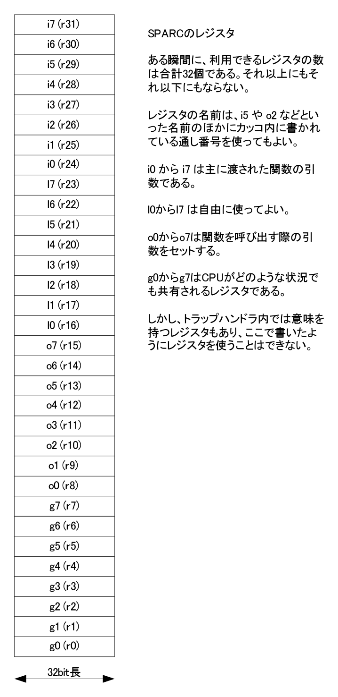

SPARC のレジスタウインドウの数は実装依存であり、一般には 32 以下の 2 のべき個で実装される。ここでは一般的な 8 個の場合を図示する。

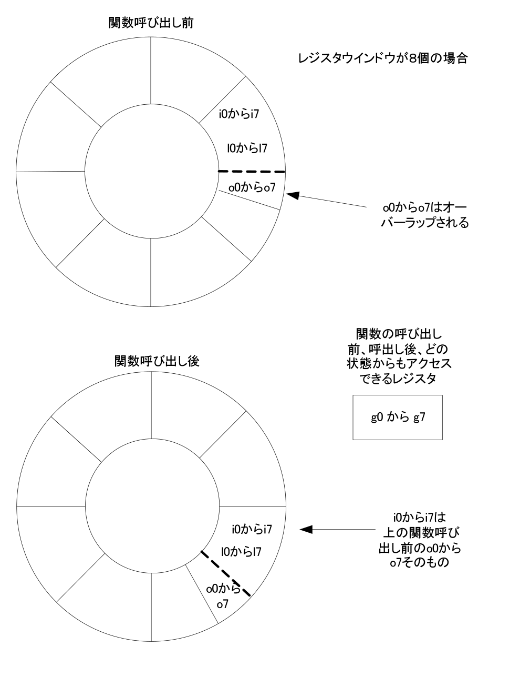

関数を深く呼び出してしまうとレジスタウインドウを一周してしまう。そのために

- ウインドウオーバーフロートラップ
- ウインドウアンダーフロートラップ

というトラップが用意されており、レジスタの内容をスタックに退避できるようにしている。

関数の引数の数も多くなってしまうとレジスタ渡しができなくなってしまう。その場合はやはりスタック渡しとなる。

## 2. 関数の呼び出し

関数の呼び出しはレジスタウインドウの移動を伴って行われる。一般的な CPU では関数の引数をスタックに積んで渡しているが、６個までの引数であれば SPARC ではレジスタ渡しが可能であり、またそれが正しい SPARC のコーディングである。６個を超える引数に関してはやはりスタックを使うことになる。

%sp は単に %o6 の別名（スタックポインタ）必ず８バイト境界を指していなければならない。
%fp は単に %i6 の別名（フレームポインタ）呼び出しもとの関数のスタックポインタ

関数呼び出しは call 命令によって行われる。
call 命令を行う前に、次のレジスタに関して注意しなければならない。

- 引数は%o0 から %o5 までを使う。
- 関数の戻り値は %o0 とする。（呼び出された側の関数は%i0 に戻り値をセットする）
- %g1 は常に一時レジスタとして利用すべき。
- スタックポインタは %o6 に既にセットされている。
- 戻りアドレスは %o7 にセットされる(call により自動的にセットされる)。

ここで注意することは call 命令自体では

> ・レジスタウインドウは一切移動しない

ということである。つまり、関数の呼び出し側も、呼び出される関数側も、例えばレジスタ %i3 といえば、同じレジスタを指し示す。この状況を図にすると次のようになる。

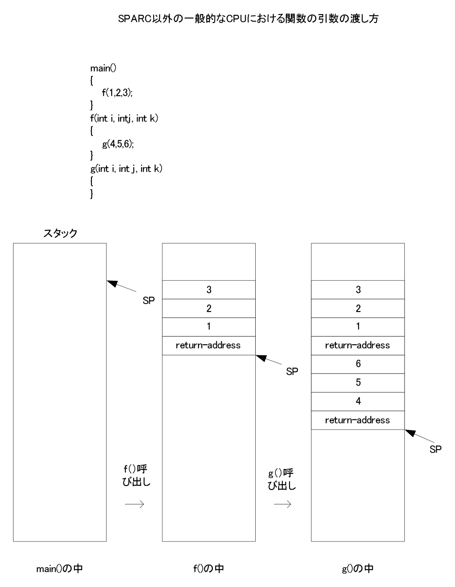

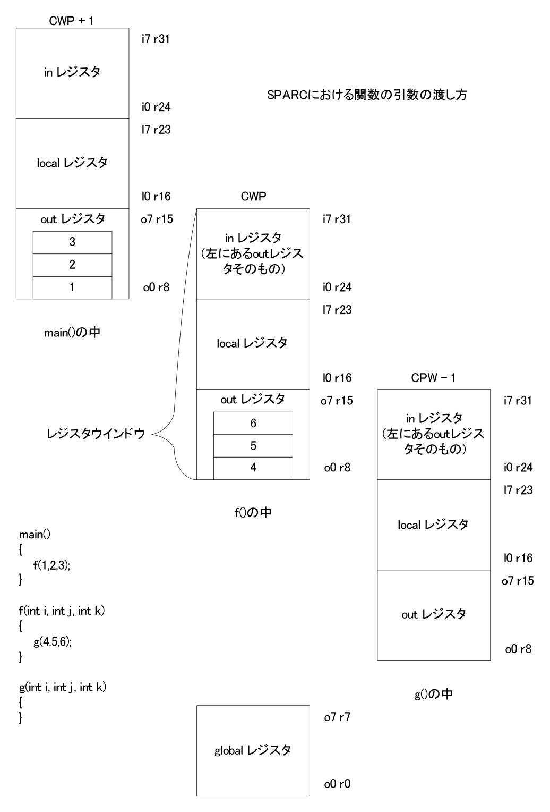

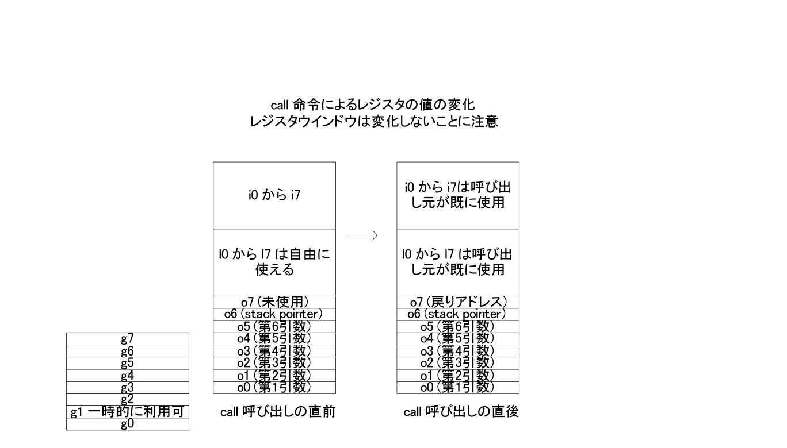

call で呼び出された関数は、呼び出し元の関数が使用していないレジスタを慎重に選ばなければならない。また呼び出し元への復帰は

retl

命令で行える。retl は %o7+8 のアドレスへジャンプする命令である。
しかしながら、SPARC は命令を先読みするため、call 命令や retl 命令の直後の遅延スロット命令は通常実行される。安全のため nop を入れることもあるが、意味のある命令を置くこともできる。

```
call  function
nop     <----- call が実行され、目的の関数の一行目の実行の前に実行されてしまう。
<------- 関数から戻ってくる場所はここ。
```

```
function:
    処理
    retl
    nop    <--- retl で呼び出し元に戻るが、その前にこの行は実行される。
```

## 3. レジスタウインドウ

呼び出された関数のなかで、多くのレジスタを使いたい場合、または上の call では関数をネストして呼び出した場合に戻りアドレスを保持するレジスタが１つしかないという問題から、通常は関数の呼び出し時にレジスタウインドウを移動させる。レジスタウインドウの移動は save 命令で行う。逆に、レジスタウインドウの復帰は restore 命令である。

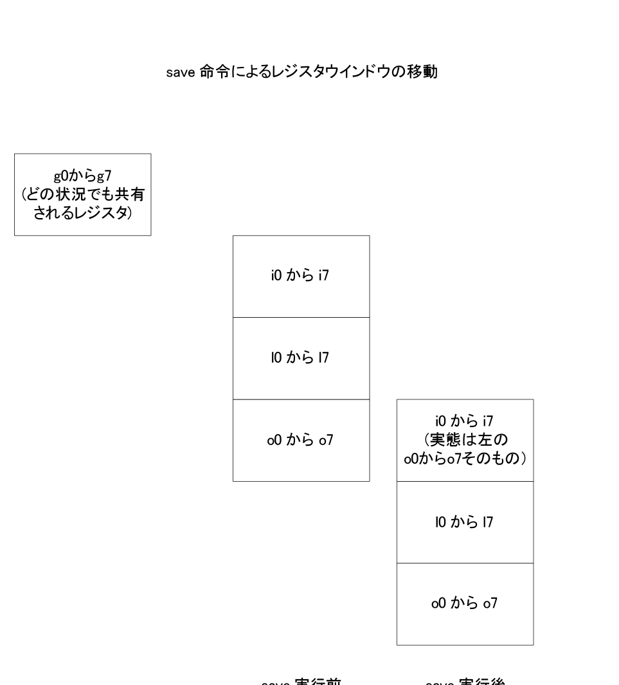

save 命令前の %o0 から %o7 が、そのまま save 命令後の %i0 から %i7 という名前でアクセスできる。図からもわかるように %l0 から %l7 は自由に利用できるレジスタである。

save と restore を使った関数呼び出しのシーケンスは次のように行われる。

```
    call function
    nop
    <------ この場所に返ってくる。

function:
    save
    処理
    ret
    restore
```

function: の中の、関数へ返る命令 ret の後に restore 命令があるが、これは SPARC の命令先読みにより、実行される。また、ret は retl とは異なり、

%i7+8 のアドレスへ復帰する

という命令である。%i7 は save 前の状態の %o7 であり、実際にこのレジスタには call にたいする戻りアドレスが格納されている。

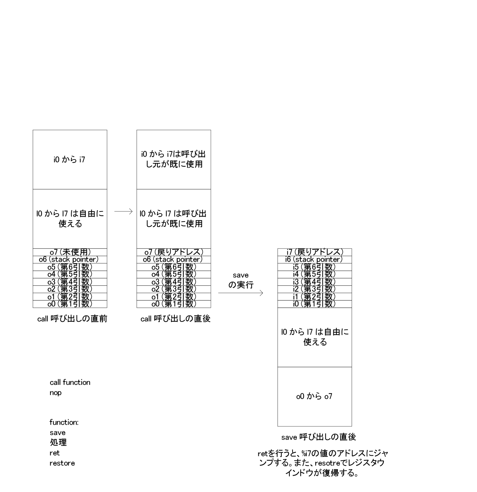

スタックポインタは %sp で操作できるが、これは %o6 の別名である。 %o6 の値は意図的に変更しない限り変わることはない。
save 命令によってレジスタウインドウが切り替わると、新たな %o0 から %o7 が出現するが、その中の %o6 はどのような値が入っているかわからない。つまり、今まで使ってきた%sp は save 後には %i6 で利用できるので、

> mov %i6, %o6

などとしてスタックポインタをコピーしていく必要があるが、これを save 命令のオペランドに指定することで自動的に行うことができる。

> save %sp, -64, %sp

と書く。-64 の意味は、スタックポインタを現在の値から 64 引くことを意味している。
save 命令に上記のように指定することで、save 命令前のスタックポインタの値が、save 命令後のスタックポインタの値にコピーされる（コピーされる）。

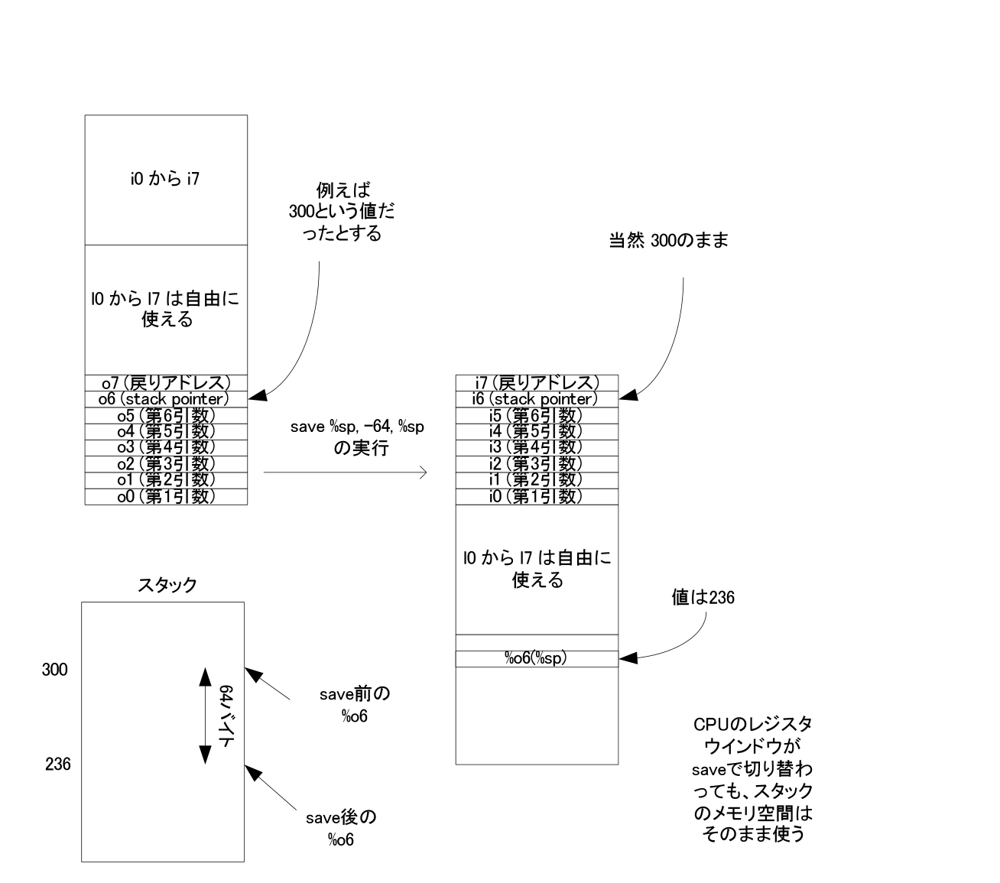

save %sp, -64, %sp 命令によって６４バイトだけ空きができるが、このエリアは後述するウインドウオーバーフロートラップが発生した場合のレジスタの退避エリアである。退避するのは

> %l0 から %l7 の 32bit レジスタ８本
> %i0 から %i7 の 32bit レジスタ８本

であるので 64 バイトでよい。%o0 から %o7 は隣のレジスタウインドウにとっては %i0 から %i7 であるので、そのウインドウによって退避される。

結局、関数の呼び出しシーケンスは次のようになる。

```
    call function
    nop
    <------ この場所に返ってくる。

function:
    save %sp, -64, %sp
    処理
    ret
    restore
```

## 4. レジスタウインドウのオーバーフローとアンダーフロー

レジスタウインドウは論理的にループ構造になっており、save を連続して実行していくと、再びもとのレジスタウインドウに戻ってくる。

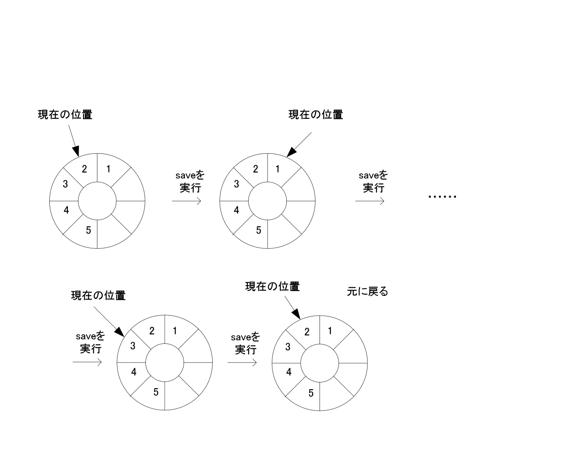

このような状況を回避するために、ウインドウインバリッドマスクレジスタと呼ばれるレジスタ%wim が存在する。%wim は 32 bit 長のレジスタであり、

> ０ビットは０番目のレジスタウインドウ
> 1 ビットは１番目のレジスタウインドウ
> 。。。
> 31 ビットは３１番目のレジスタウインドウ

を表している。

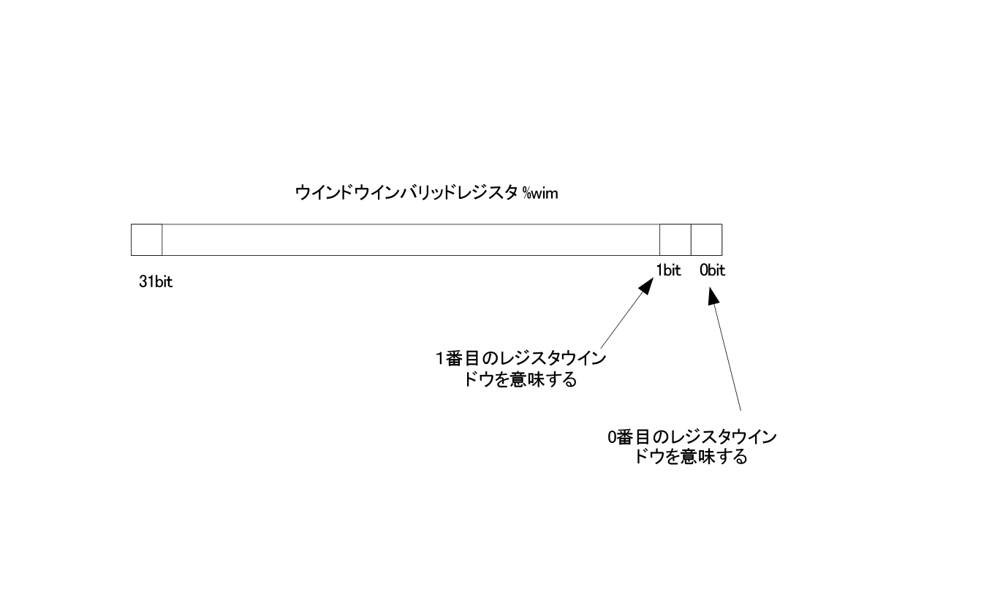

save または restore 命令によって、ビットが立っているレジスタウインドウに入った場合にそれぞれウインドウオーバーフロートラップ、ウインドウアンダーフロートラップが発生する。

| 動作 | トラップ |
|---|---|
| save により%wim の指定するウインドウに入る。 | ウインドウオーバーフロートラップ |
| restore により%wim の指定するウインドウに入る。 | ウインドウアンダーフロートラップ |

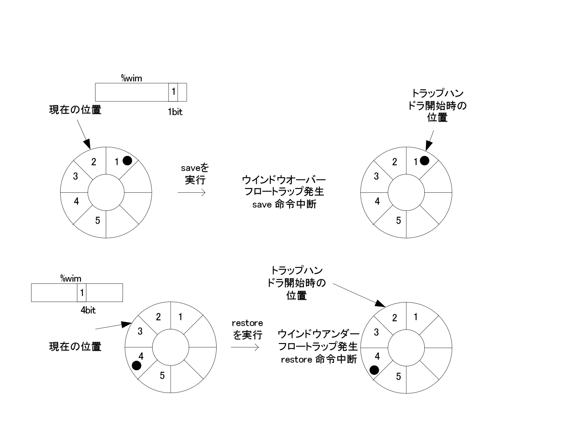

このように、%wim のビットをどこか１つ（複数も可能である）立てることで、連続した save によるレジスタウインドウのオーバーフローや、連続した restore によるレジスタウインドウのアンダーフローを保護することができる。
また、%wim のビットが立っているレジスタウインドウは

- 未使用
- 既にレジスタ %l0 から %l7, %i0 から %i7 の内容がスタックに退避されている

かのどちらかでなければならない。使用中のレジスタウインドウに対して %wim でビットを立ててはならない。

さて、次にウインドウオーバーフロートラップハンドラでの処理を考える。オーバーフローが発生するということは、レジスタウインドウを一周してしまったことを意味する。

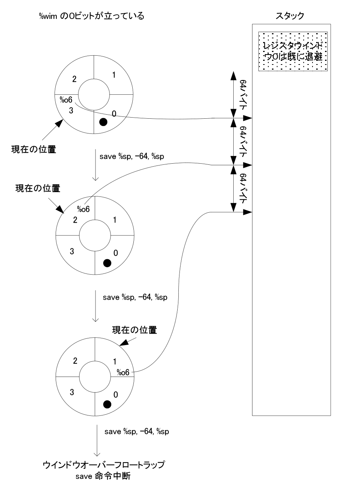

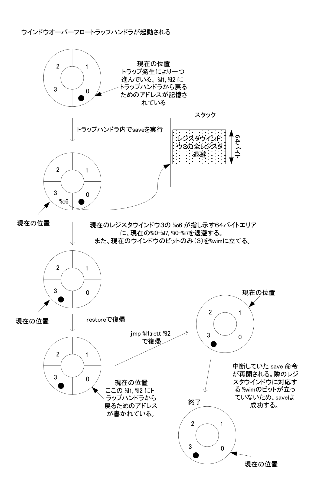

ウインドウアンダーフロートラップはこれとは逆の手順を踏む。
面白いことに、

「トラップが発生したら、レジスタウインドウを save で進める」

という約束事があるため、トラップの原因になった restore よりも１つ save 側に「現在の位置」が進んでしまっている。

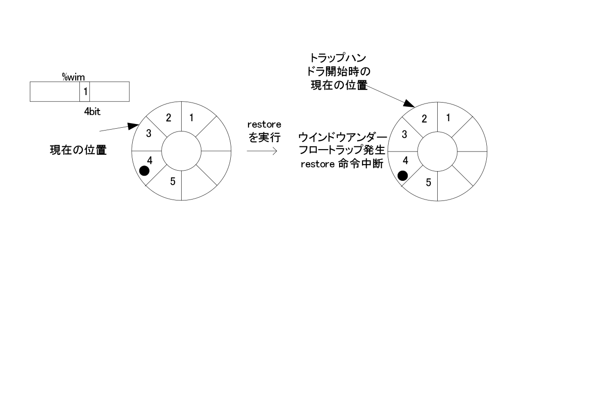

そこで、上図の場合、レジスタウインドウを restore を繰り返して 5 の位置まで移動し、5 の位置を意味する %wim の 5bit を立てる。

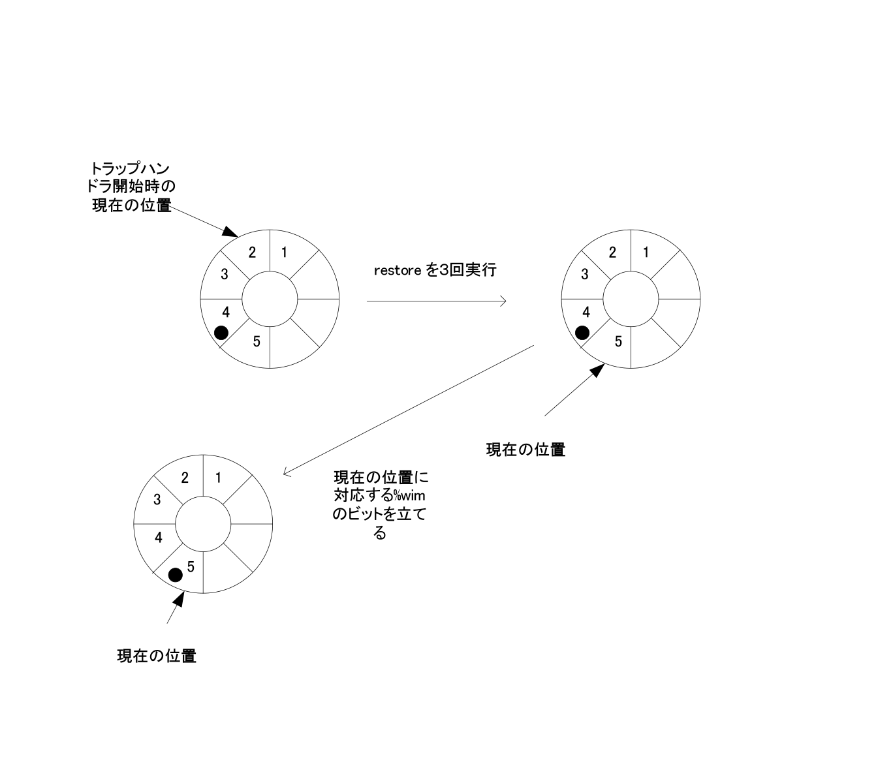

そのとき、レジスタウインドウ５のレジスタをスタックに退避する必要はあるだろうか？
それはありえない。なぜならば、トラップ発生前の「現在の位置」よりも前にあるレジスタウインドウは基本的に「未使用」であるからだ。

前にある、つまり save していく側にあるレジスタウインドウは、「これから呼び出しを行う関数が使うレジスタ」であり、今の時点でそれらのレジスタに保持すべき値が入っているはずはない。

したがって、５の位置に%wim のマークを付けるだけでよい。ここで１つ save で４の位置に戻る。この位置は、今まで %wim でマークが付けられていた場所である。つまり未使用か、またはレジスタの内容がスタックに保存されている。
いずれにしても、４のレジスタウインドウに関しては、スタックから値を復帰させればよい。

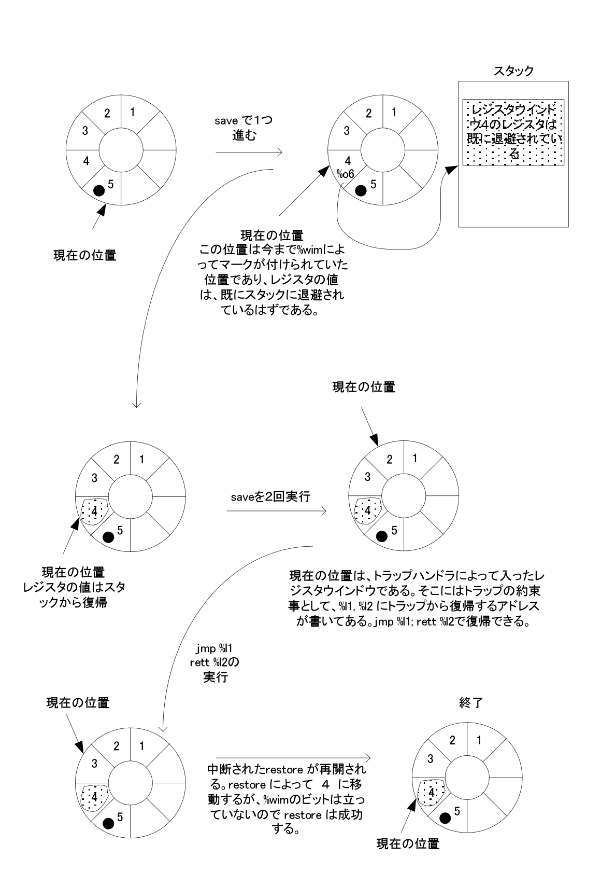

今まで無造作に save や restore 命令を繰り返していたが、やはり %wim により指定されたウインドウにはいるとトラップは発生する。そのため、このようなルーチンの中では最初に %wim を退避してから %wim の全てのビットをクリアしたのち save & restore 操作する必要がある。

## 5. トラップ

割り込みやトラップが発生すると対応する割り込みハンドラが起動する。その際にいくつか約束事があるのでここで列挙する。

| トラップ発生時の事象 |
|---|
| ET＝０。これは外部割り込みをも無視する。ただし PIL は変化しないことに注意。トラップからの復帰命令を実行すると ET=1 となる。 |
| スーパバイザモード (CPU の全ての命令を実行可) |
| CWP をデクリメント （save 動作を行ったものと同じ） |
| PC および nPC を r17(l1) および r18(l2) に保存（新しいレジスタウインドウ内） |

| 種類 | 利用可能レジスタ |
|---|---|
| Trap（syscall 等） | %g1, %i0-%i5, %i7, %l0, %l1, %l3-%l7 |
| Fault, Interrupt | %l0, %l3-%l7 |

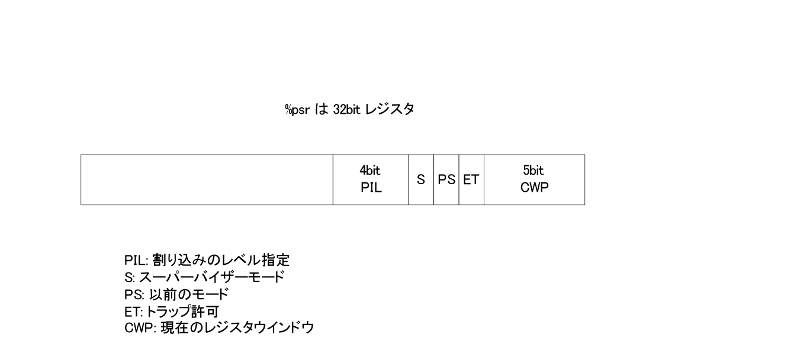

%psr レジスタは割り込みのマスクなどに利用される。また、下位５ビットで現在のレジスタウインドウを表している。ET ビットによって、トラップの発生の可否を制御している。

S はスーパーバイザーモードを意味しており、CPU の全命令が実行できる。S ビットが立っていなければ制限された命令のみを実行できる。PS ビットはトラップまたは割り込みによって制御が割り込みハンドラに移行した場合に、割り込み前のモードがスーパーバイザーモードであればビットが立つ。

PIL は周辺機器からの割り込みにたいするマスクである。ビットを全て立てれば周辺機器からの割り込みは保留される。PIL は 4 ビットであり、割り込みレベル 0 から 15 を制御できる。

## 6. トラップとレジスタウインドウ

ここでいうトラップとは、「ウインドウオーバーフロー、アンダーフロー以外の全てのトラップ」である。
トラップが発生すると必ずレジスタウインドウは save を行ったかのように移動している。
ここで重要なのは、

> 仮に移動した先のレジスタウインドウが %wim で指定されてあったとしても、移動だけは行われてしまい、ウインドウオーバーフロートラップの類は発生しない

ということである。
つまり、トラップの入り口では必ず、現在の位置が %wim で指定されているかどうかを確認する。そしてもしそうであれば、自らがウインドウオーバーフロートラップの処理と同じ処理を行う。

逆に、トラップから復帰する先のレジスタウインドウが、%wim によって指定されている場合（これはタスク切り替えなどで発生する）、自らがウインドウアンダーフローの処理と同じ処理を行ってからトラップからの復帰を行う。

## 7. タスクの切り替え

タスクを切り替える際にレジスタを全てスタックに退避しなければならない。SPARC の場合は、全てのレジスタウインドウのレジスタを退避することになる。

まず、タイマーにより割り込みが入った状況を考える。割り込みにより、レジスタウインドウが移動し、そして移動後のレジスタウインドウで

> %l1 に今まで動いていたタスクのプログラムカウンタ PC

> %l2 に今まで動いていたタスクが実行すべき次の命令の場所 nPC

がセットされる。通常 nPC は PC +4 の値である。
割り込みハンドラからの復帰は

```
jmpl %l1, %g0
rett %l2
```

で行う。単純に復帰してしまえば、今まで動作していたタスクが再び動くことになる。

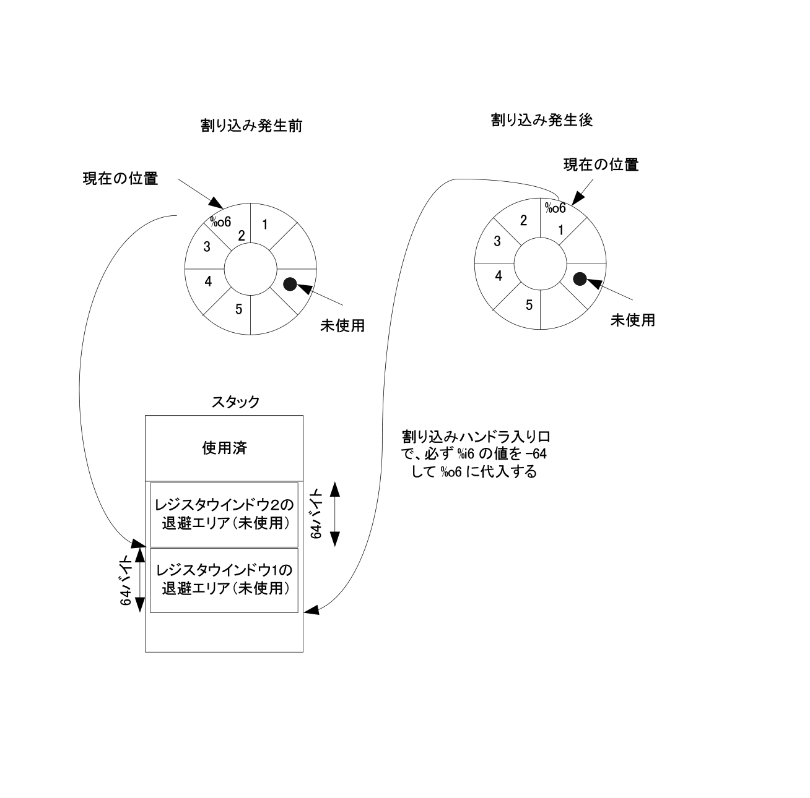

タスク切り替えのために、割り込みハンドラは必ず自分が利用するレジスタの退避用スタックエリア 64 バイト分を確保しなければならない。
つまり割り込みハンドラの入り口は次のようになっている。

```
タイマ割り込みハンドラ入り口:
    add %i6, -64, %sp
    処理
    ...
```

タスクを切り替える場合には、現在の環境を保存しなければならない。そのために、レジスタウインドウの数マイナス１回分 save を実行する。この例ではレジスタウインドウが８個なので、７回 save を行うことになる。
それを行う前に、%psr の ET ビットを有効にして、「レジスタウインドウオーバーフロートラップ」が発生するようにしておく。このオーバーフロートラップによって、レジスタの値をスタックに退避させるのである。

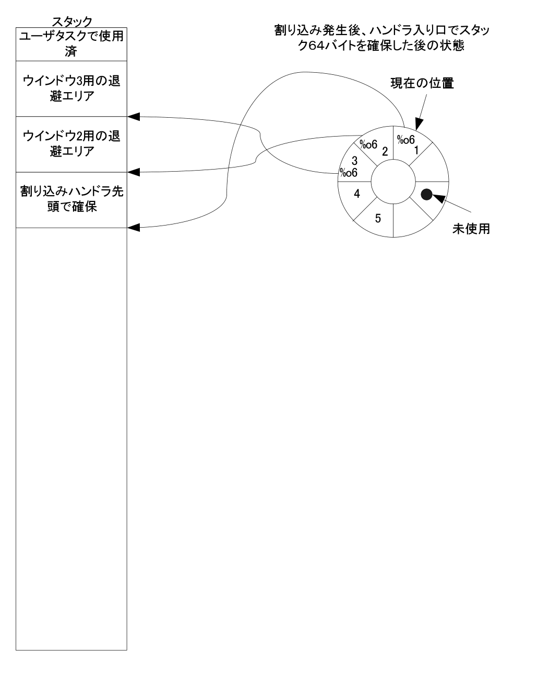

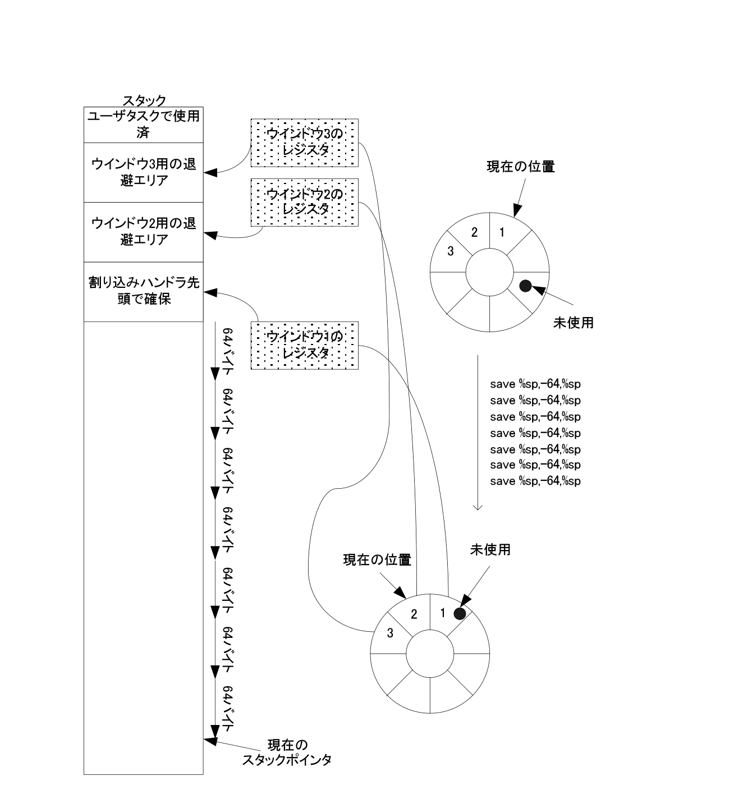

次に restore を7回実行する。

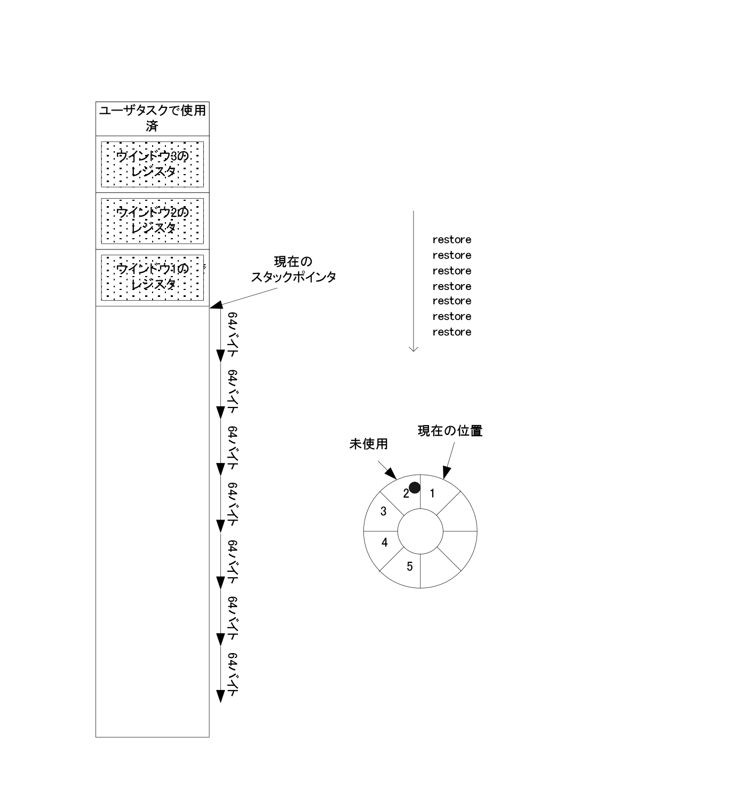

スタックには今現在使っているレジスタも全て退避される。
この状態で、現在のスタックポインタの値、そして現在の %psr の値を proc 構造体などに保存する。例えば、P[3]で管理されるタスクであれば、

```
P[3].sp = %o6;
P[3].psr = %psr;
```

とする。

タスク切り替えの前準備は終わったので、これから新しいタスクを動作させる。

選択されたタスクは同様の手順によってスタックにレジスタウインドウが保存されているはずである。

最初に行うことは、レジスタウインドウの番号を保持する %psr を復帰させることである。
次にスタックポインタの値を復帰させる。

```
%psr = P[4].psr;
%o6 = P[4].sp;
```

この順番をあやまってはならない。%psr を書き換えると、「現在の位置」が変わってしまうからである。
そして、%wim に対して、現在のレジスタウインドウに１を加えた値にする。これにより全てのスタックに退避されたレジスタの値が restore により復帰される。

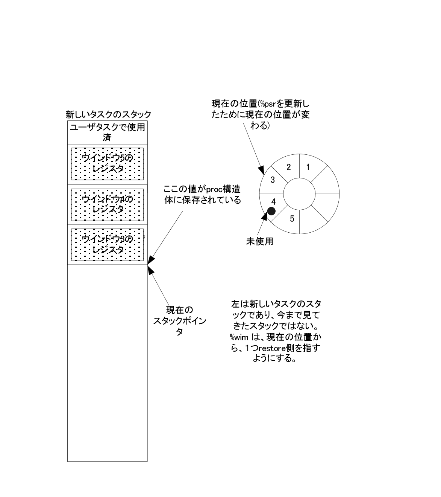

この例では%psr を復帰したため、カレントウインドウが 3 となった。
そして %sp を proc 構造体より復帰する。その後、スタックに積まれているウインドウ３のレジスタを全てカレントレジスタに復帰する。
そして %wim に関しては、スタックに退避されたレジスタ値が、復帰できるように、現在の位置から１つ restore 側の位置を指すように設定する。

最後に現在利用しているレジスタを、スタックに積んである値で置き換える。
復習になるが、save 側のレジスタ、つまり、2 や 1 に関しては、「これから呼び出す関数が利用するレジスタ」であり、特に値を設定する必要はない。
また、restore 側のレジスタは、すぐ隣のウインドウが %wim で指定されているために、ウインドウアンダーフロートラップが発生する（または、割り込みからの復帰処理時に同様の処理が行われる）。ウインドウアンダーフロートラップはスタックから値をレジスタに戻すので、このようにして全てのレジスタ値は新しいタスクのものとなる。

## 8. タスクの生成

タスクの生成は、あたかも動作中のタスクがトラップによって割り込まれたような状態を作り出せばよい。トラップされた状態はたとえば次のようになる。

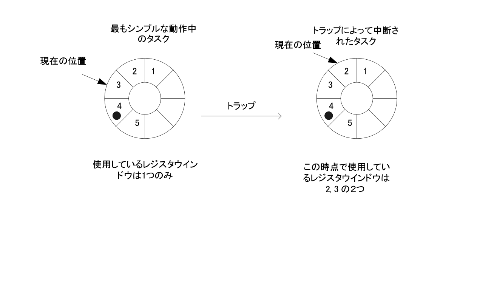

このタスクをあたかも今まで SLEEP 状態であったとするためには、ここで考えた２つのレジスタウインドウをスタックに積めばよい。

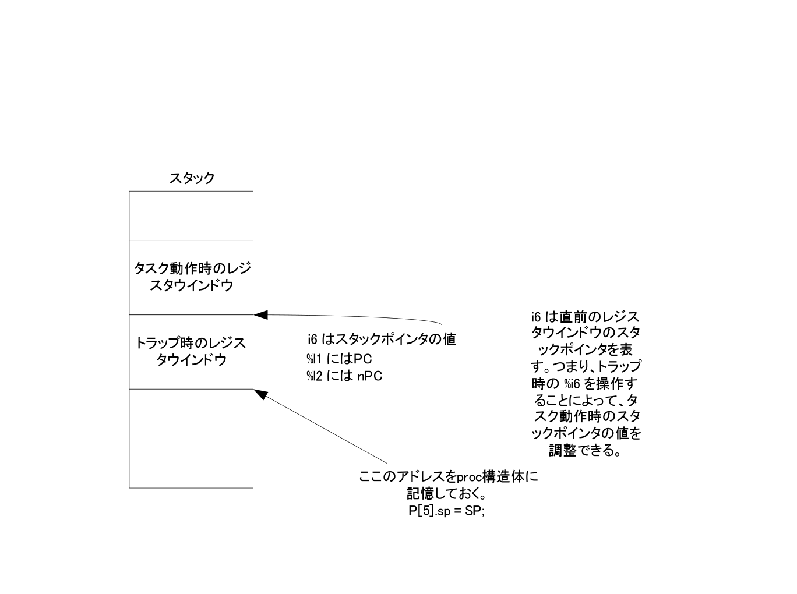

## 9. スタック構造

関数の引数が 6 個以上ある場合、それはスタックで渡されるが、実は、

> 呼び出す側のスタックに積まれ、呼び出される側のスタックではない。

という特徴を持つ。しかしながら、

> 呼び出される側は、呼び出す側のスタックポインタを %fp （これは %i6 の別名）で直接触ることができる

ために、特に問題はない。
レジスタ渡しを行える６個の引数であるが、例えば、

```c
func(int i)
{
    int* p;
    p = &i;
    p を使った処理
}
```

は考えうる関数である。ところが、int i がレジスタで渡ってしまうとこのようなコードに対応できない。この場合でも、引数をスタックに積んで渡しておけばよい。

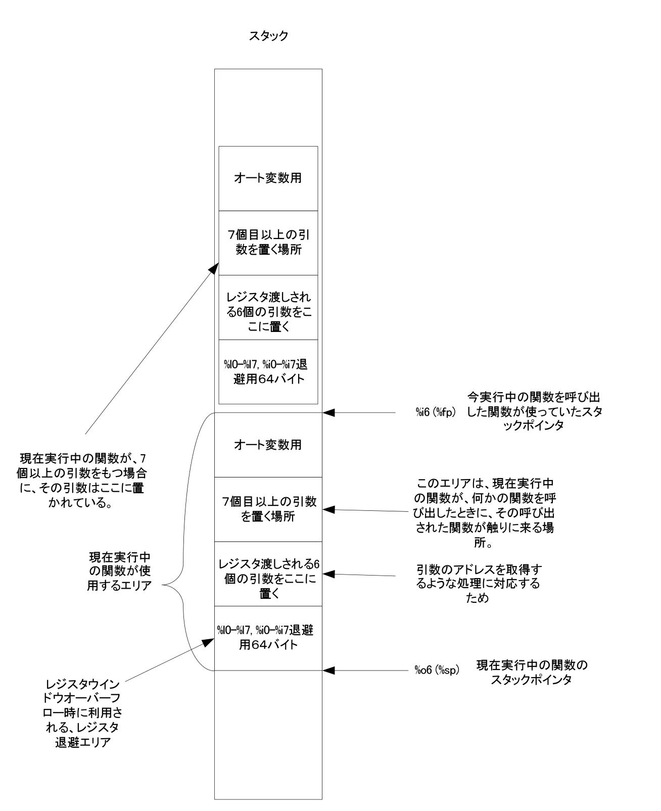

## 10. 命令の遅延実行

Control-Transfer Instructions というのは Bicc,CALL,JMPL,などの分岐命令。

| カテゴリ | 例 | 解説 |
|---|---|---|
| conditional-delayed | Bicc,FBfcc,CBcc | a ビットにより異なる。コンディショナル（おそらくステータスレジスタのビットを参照するとかしないとか）かどうかでも異なる。 |
| delayed | CALL,JMPL,RETT | 命令実行後、PC は１命令遅れてから変更 |
| non-delayed | Ticc トラップ | 命令実行後、即座に PC が変更 |

遅延命令とは delayed な分岐命令（PC が１命令後に変更される）ときの PC+4 が指す命令。
call の説明で触れたが、SPARC では１つ先の命令を読みこみ、命令実行の流れに問題がなければそのまま実行する。

```
    call 関数
    <------- この命令は call によって呼び出される関数が実行される前に実行される
```

効率を重視するのであれば、呼び出される関数の先頭の命令を call 命令の下に置いておく。

```
    call 関数
    上の call 命令で呼び出される関数の先頭１命令
```

しかしながら、条件ジャンプ命令など、必ずしもある命令の次の命令が自動的に実行されては困る場合もある。SPARC では命令の a bit というビットを使って、これを制御している。

```
    分岐命令(ba とかの分岐命令)
    遅延実行命令(任意の命令)
```

| a bit | 分岐のタイプ | 遅延実行 |
|---|---|---|
| 0 | 条件分岐を実行 | 行う |
| 0 | 条件分岐は実行しない | 行う |
| 0 | 無条件分岐を実行する | 行う |
| 0 | 無条件分岐を実行しない | 行う |
| 1 | 条件分岐を実行 | 行う |
| 1 | 条件分岐は実行しない | 行わない |
| 1 | 無条件分岐を実行する | 行わない |
| 1 | 無条件分岐を実行しない | 行わない |

（SPARC V8 Architecture Manual P52）

無条件分岐を実行する命令は、 ba であり、無条件分岐を実行しない命令は bn である。
また、a ビットを示すには、

> 分岐命令,a

というフォーマットになる。ba, bn はそれぞれ

```
    ba,a    ラベル
    bn,a    ラベル
```

となる。

## 11. プログラムステータスレジスタ

割り込み、トラップなどが発生すると、プログラムステータスレジスタ %psr にそれが反映される。

タイマ割り込みの場合

割り込み発生直後

| ET | １から 0 へ |
|---|---|
| PIL | 変化なし |

ET が０になる場合には周辺機器からの割り込みは「無視」される。ここで保留されるわけではないことに注意しなければならない。PIL は割り込みを保留する。PIL の全ビットを立てると割り込みが保留され、ビットを落とせば保留された割り込みが発生する。
周辺機器は、割り込みをレベルトリガーで出し続ける必要があると思われる。

## 12. 割り込みの種類

| ベクタ番号 | 種類 |
|---|---|
| 0x01 | 命令アクセス例外 |
| 0x02 | 不正命令 |
| 0x03 | 特権命令 |
| 0x05 | ウインドウオーバーフロー |
| 0x06 | ウインドウアンダーフロー |
| 0x11 | 割り込みレベル 1 |
| 0x12 | 割り込みレベル２ |
| 0x13 | 割り込みレベル３ |
| 0x1f | 割り込みレベル１５ |

## 13. 割り込みベクタ

SPARC での割り込みの取り扱いは、割り込みハンドラの先頭４命令を配列として用意し、その配列の先頭アドレスを%tbr レジスタにセットする。
主として ba 命令によるブランチを実行することになるので

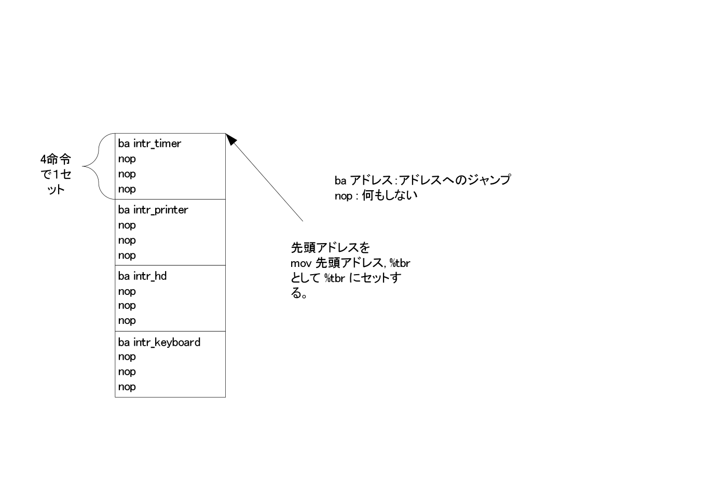

## 14. システムコール

タスクはシステムコールを使って、要求を発行することができる。SPARC では ta 命令が用意されている。

```
ta 0x10
```

（注）アセンブラやOS実装によっては別記法を許容する場合があるが、ここでは標準的な即値トラップ番号の記法で示す。

ta 命令によりトラップが発行され、ベクタで指定した

> 0x80 + トラップ番号

のトラップハンドラが起動される。
トラップによりレジスタウインドウが移動してしまうので、レジスタ%o を使って渡すことにする。

```
%o0 システムコール番号
%o1 引数１
%o2 引数２
%o3 引数３
%o4 引数４
```

システムコールの戻り値は、%o0 にセットされる。

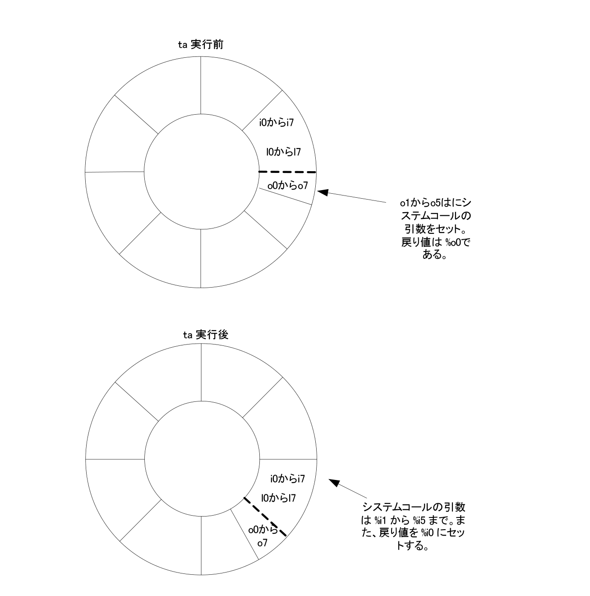

また、トラップの場合は、単純に他の割り込みと同じように

```
    jmpl %l1, %g0
    rett %l2
```

でリターンすると、ta 命令そのものに返ってしまうようであり、再びトラップが発生してしまう。そこで、意識的に ta の次の命令にジャンプする必要がある。
つまり、%l1, %l2 を４インクリメントしておけばよい。

```
    inc 4, %l1
    inc 4, %l2
```

または、効率を重視するならば、トラップから返る時に

```
    jmpl %l1, %g0
    rett %l2
```

ではなく

```
    jmpl %l2, %g0
    rett %l2 + 4
```

とする。

## 15. アライメント

データアクセス時ののデータアライメントに注意する必要がある。SPARC は命令によって、４バイト境界のみしかアクセスできないものもあれば、奇数番地にアクセスできる命令もある。コンパイラは正しくコードを出力するが、アセンブリ言語で書く場合は注意が必要である。

## 16. 例外ハンドラ

タスクが、例外ハンドラを登録し、あるタイミングでその例外ハンドラを起動する必要にせまられるかもしれない。その場合の処理を示すが、必ずしも必須の機能ではない。

例外ハンドラは関数である。割り込みから復帰したときに、タスクが割り込まれた場所から実行するのではなく、例外ハンドラが起動されるようにしたい。そして、例外ハンドラが終了すると、その戻り先がタスクが割り込まれた場所になる。SPARC でこのような動作を行うことは他の一般的な CPU と違って大変困難になる。

方法としては
a) タスクが割り込まれたときに、例外ハンドラコール用のレジスタウインドウを確保する。
b) 割り込みから復帰するときに、例外ハンドラコール用のレジスタウインドウを確保する。

の 2 通りある。もちろんこの２通りしかないわけではない。a)であると最悪ウインドウオーバーフローの処理を２回行うことになる。b)であると最大でも１回のウインドウオーバーフロー処理で済む。または、無視して%wim で指定されたウインドウを使ってしまってもよい。なぜならすぐに復帰するからである。

```
    jmp %l1, %g0
    rett %l2
```

通常復帰するコードは上記の２命令であるが、これを実行する直前に例外ハンドラを登録することにする。ウインドウのオーバーフローに関しては発生する状態である。またデバイスからの割り込みは禁止していなければならない。

さて、現在のウインドウを exception_handler 用とする。そのため、%l0, %l1, %l2 など必要なパラメータはセットしておく。また、割り込まれたタスクへの復帰を行うために、%o6 には タスクの実行アドレスを代入する。

次に save により一つウインドウを移動し、

```
jmp %l1, %g0
rett %l2
```

と同様の処理を行うが、ここで復帰したい関数は exception_handler のアドレスであるので、

```
set exception_handler, %l1
add %l1, 4, %l2
jmp %l1, %g0
rett %l2
```

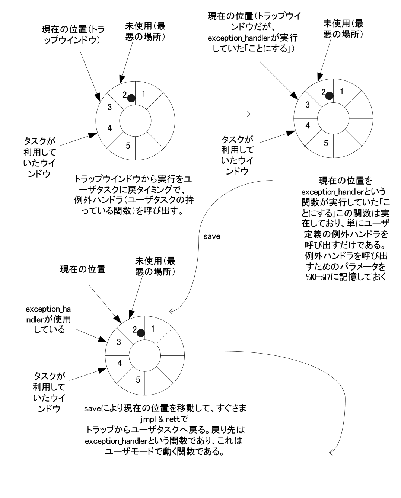

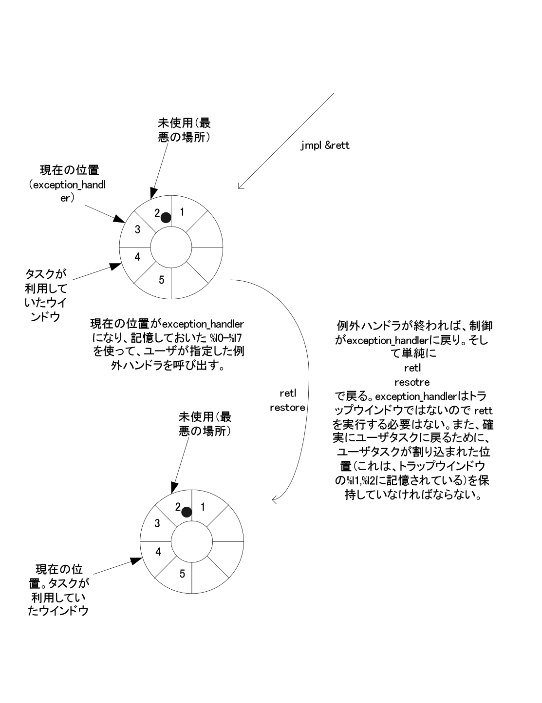

とする。

## 17. 割り込み時の PC と nPC

デバッガを利用した結果である。カレントプログラムカウンタの指す

\>

記号は、これから実行する行を指し示す。PC にその行のアドレスが入っているが、実行はされていない。1 ステップ実行すると、PC は次の命令を指し、そして先ほど PC が指していた行が実行される。
トラップなどで%l1, %l2 に記憶される PC, nPC はまだ実行されていない命令の番地である。したがって、例外ハンドラが戻る先は %l1 ということになる。

```
    mov %l1, %o7
    retl
    restore
```

## 18. ET と割り込み

PSR レジスタの ET は 1 でトラップ許可、0 で禁止である。トラップが発生した場合には自動的に 0 となる。RETT で戻る前には 1 にしておく。

ET が 0 のときは、割り込みは無視される。しかしこの状態で同期トラップが発生すると、プロセッサはエラーモードに遷移する可能性がある。
したがって、ET=0 の状態でウインドウオーバーフローなどが起きるコードは避けるべきである。

PSR レジスタの ET ビットを０にする直前で割り込みが発生した場合、PSR への操作は無効になってしまう。つまり、

```
    wr %g1, 0, %psr   ! ET を１から０にする
    nop
    nop
    nop              ! ここで%psr の ET が０になる。
```

**このようなコードを書いてはならない。wr 命令が反映される３命令後までに、外部割込みが発生すると%psr への書き込みは行われない。かならず外部割込みを禁止した後に%psr の ET ビットを操作しなければならない。**

```
    外部割込みの禁止
    wr %g1, 0, %psr   ! ET を１から０にする
    nop
    nop
    nop              ! ここで%psr の ET が０になる。
```

## 19. restore の動作

restore は命令終了後にウインドウの移動を終える。次の命令はどのように動作するだろうか？

```
    restore
    add %i6, -96, %sp
```

%sp は %o6 のことである。restore 命令が終了した段階でレジスタウインドウの移動が終わっている。そして add 命令が実行されることになる。

## 20. PIL と ET の関係

PIL は割り込みマスクであり、トラップ（割り込み）許可フラグとして ET がある。
PIL のビットを全て立てると外部割込み禁止となる。このとき、ET ビットの on/off は関係ないように見える。
ET ビットが立っており、PIL が 0 であると外部割込みが許可される。割り込みが入ると ET は０となる。PIL は変化しない。
ここで（上の状態に引き続き）、PIL を操作しビットを全て立てると外部割込みを無視する。
ところがこの状態で ET のビットを 1 にすると、再び外部割込み「最初に許可された割り込み信号線のレベルが HI のままであると」が発生してしまう。
つまり、割り込みは早い段階でデバイスからの割り込み要求をクリアする必要がある。
補足として、割り込み許可状態から PIL=0xf, ET=0 に同時にしようとした場合、%psr に値を書き込んで 3 命令内に割り込みが入ると、PIL は後に反映されるが ET は 1 のままになる場合がある。したがって、この操作は実装依存性を考慮して慎重に扱う必要がある。

## 21. ASI とメモリ空間

SPARC プロセッサは ASI(アドレス空間識別子)を用いてカーネルとユーザタスクのメモリ分離を容易に行えるようになっている。次の値は予約されている。

| ASI 値 | アドレス空間 |
|---|---|
| 8 | ユーザテキスト |
| 9 | スーパーバイザーテキスト |
| 10 | ユーザデータ |
| 11 | スーパーバイザーデータ |

プロセッサがスーパーバイザモードでインストラクションを読み込む際の ASI は 9 であり、データアクセスする際は 11 である。ユーザタスクのインストラクションを読み込む際は ASI は 8 であり、ユーザデータにアクセスする際は 10 である。このように ASI は自動的に変化し、それにともなって、メモリデバイスを切り替えることによりユーザ空間とカーネル空間の分離が容易に行えるようになっている。

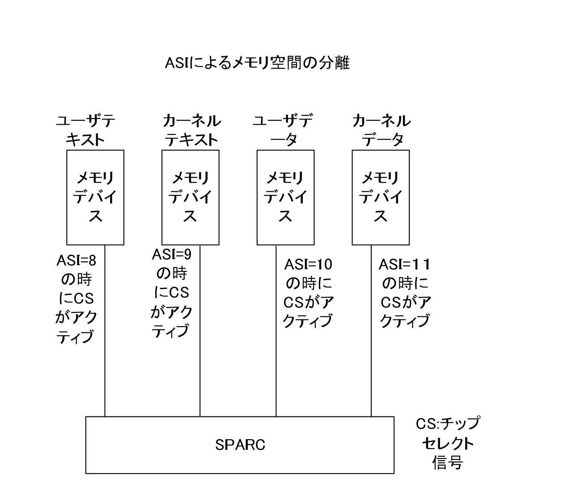

ユーザ空間とカーネル空間を区別しない場合は、ASI がインストラクションやデータに対応する値になった場合に常にチップセレクト信号を発行すればよい。

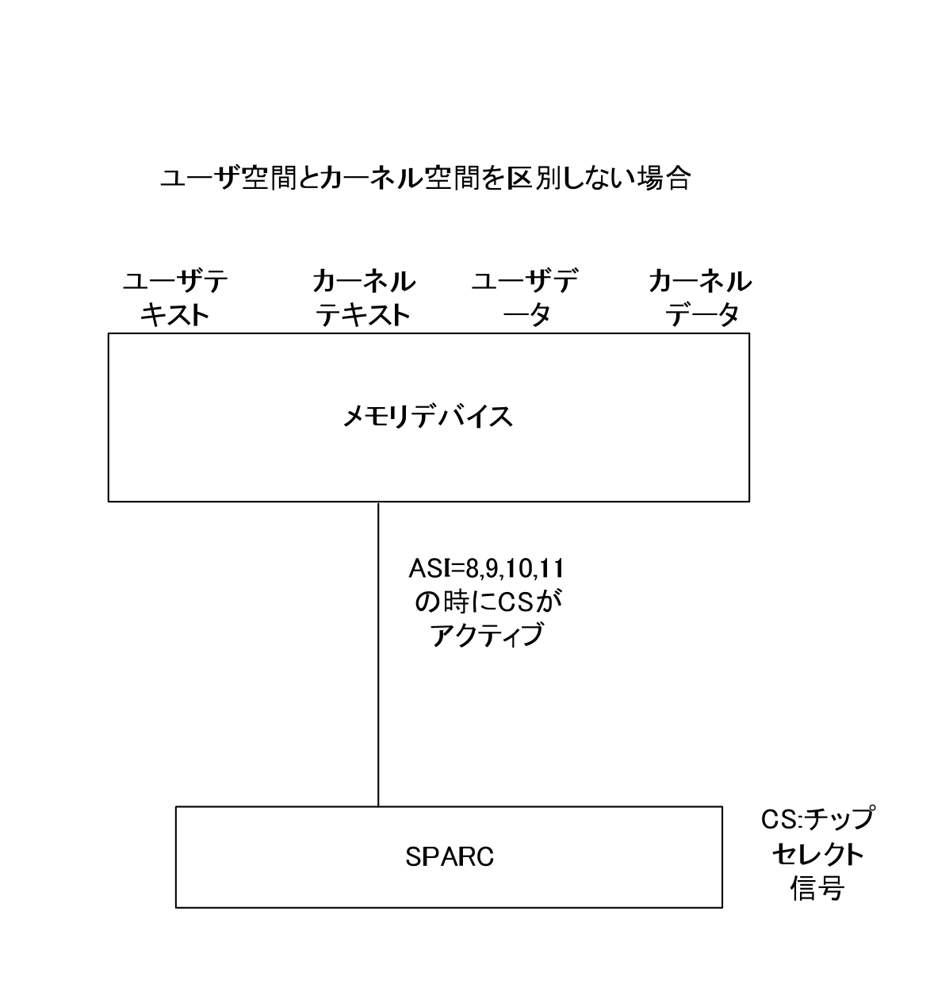

## 22. ユーザモードへの復帰

通常の CPU であれば、CPU フラグレジスタが割り込みとともにスタックに詰まれ、単純に、割り込みからの復帰によって、以前の CPU モードに戻る。以前のモードがユーザモードであれカーネルモードであれ関係は無い。
ところが、SPARC はどうやら PSR レジスタの PS ビットが１の時は割り込みからの復帰を行ってもそのままスーパーバイザーモードに居座る。PS ビットが０であればユーザモードに復帰する。このことは多重割り込みやシステムコール中の割り込み許可処理に大きな負担を強いることになる。カーネルは全ての状態を把握し、割り込みからの復帰がユーザタスクへの復帰であるかどうかを常に確認する必要があるということである。
回避策として、割り込みが発生したときには必ず PSR レジスタを退避させていた。これを割り込みからの復帰時点で復活させればよい。
PSR レジスタの明示的な退避復活は必須なのである。

## 23. マスク不能割り込み

PIL 15 の割り込みをマスク不能として扱うかどうかは実装依存である。ここでの説明は mrbpci ボードでの観測結果として扱う。
mrbpci ボードのタイマ割り込みは IRQ15 として入力されるのでマスクができないのである。
しかし、ET=0 とすればマスク不能の IRQ15 ですら割り込めないことがわかった。ET=0 はウインドウとラップもできないのでごく限られた場所しか使用できないが、IRQ15 をも無視したい場所では ET=0 とすればよい。

## 24. キャッシュ

4KB 2 ウェイセットアソシエイティブキャッシュについて考えよう。

| 4KB/2Way Set Associative | 値 | 解説 |
|---|---|---|
| Bank 数 | 2 | 一つのラインに対して、バンク（キャッシュ）が２個 |
| Line/Bank | 64 | 一つのバンク（キャッシュ）にはラインが 64 個 |
| Sub Block/Line | 8 | 一つのバンク（キャッシュ）の一つのラインにはデータ格納領域が８個（サブブロック）。 |
| Byte/Sub Block | 4 | 一つのデータ格納領域は 4 バイト格納可能。 |

データキャッシュは ASI=0x0E, 命令キャッシュは ASI=0x0C にある。

キャッシュレジスタが置かれているアドレス
Bank1=0x00000000-0x000007e0
Bank2=0x80000000-0x800007e0
上の 2 つのアドレスは、キャッシュそのものやキャッシュデータではなく、あくまでレジスタの場所であることに注意する(ASI=0E の場合。もし ASI=0x0F にすればまさにキャッシュデータそのものになる)。レジスタの範囲は 0 から 7e0 なのだが、レジスタ間は 32 番地離れているらしいので、(0x7e0 / 32 = 63)となり、ライン数に一致するがそのことに特に意味はなさそう。で、キャッシュデータはつまり１ライン 4x8=32 バイト。それが 64 ラインで 2KB。２つバンクを用意して合計 4KB。

その 32bit レジスタの構造を見て見よう。

| ビット | 解説 |
|---|---|
| 31-11 | タグ。これからアクセスするアドレスの 31-11 ビットと比較する。比較して一致すればそのデータはキャッシュ上にある可能性がある。ただし最初に比較するのはライン番号。 |
| 10-6, 4-2 | 有効ビット。１つのライン（１つのバンク）は合計８個のデータ（サブブロック）を格納できる。それぞれのデータが有効であるかないかをこの 8bit で示す。 |
| 5 | User/Supervisor |
| 1 | LRU |
| 0 | Entry Lock |

このレジスタはキャッシュの状態を表す物であり、このレジスタだけを見てもどのアドレスのデータをキャッシュしているのか、すぐに分からないようになっている。このあたりは実際にキャッシュヒットの処理を見る必要がある。

それでは次にラインとは何なのか？ということだが図を見てほしい。


左右の箱は２つのバンク（キャッシュ）であり同じ構造をしている。縦に振った数字がラインである。このラインは、比較対照の（CPU がアクセスする）アドレスの 10-5 ビットとして取り出される。すると１つのライン（行）が選択されるが、そこで２バンクの処理が行われる。１つのバンクのキャッシュラインにはアドレスが連続する 32bit のデータが８個格納されている可能性がある。そしてタグ(31-11bit)比較が行われることになる。2 つバンクがあるので、最大２回タグの比較が行われる。タグが一致すると、これでバンク、ラインが特定される。気になるのは 31-5bit までの比較で、1 つのバンクの４バイトのワードデータ 8 個を指定した事に本当になっているのだろうか？
4 x 8= 32 だから 32 番地分が一つのバンクの一つのラインにある。これを決定するには 31-5bit があればよい。問題なさそうだ。

最後に比較対照の CPU が使うアドレスの 4-2 ビットをもとに、８個のワードデータのうちの１つ(4 バイトデータ)を特定する。

32 ビットの CPU がアクセスするアドレスを次のように分割する

| CPU が使うアドレスの各ビット | キャッシュ側での処理 |
|---|---|
| 31-11 | キャッシュのタグと比較 |
| 10-5 | ラインとして使う |
| 4-2 | １つのキャッシュラインの８個のワードデータのうちの１つを指定する。 |
| 1-0 | 合計 4 バイトを指定しうるが、１つのワードデータは 4 バイト。 |

キャッシュをロックするにはタグロックレジスタ、
キャッシュを破棄するにはインバリデートレジスタを使う。
キャッシュをフラッシュする手順は、対象実装（MB86830）のハードウェアマニュアルで確認すること。

## 25. キャッシュの初期化

リセット後、キャッシュは OFF 状態になっている。インバリデートレジスタに 1 を書き込むと Valid ビットがクリアされ、キャッシュ内容が無効になる。

最後に CBIR レジスタ（ASI=0x01 のアドレス０番地）のキャッシュイネーブルに 1 を書き込む。
